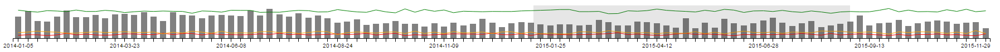

## Introduction

<a href="http://shiny.rstudio.com/" target="_blank">Shiny</a> is a web application framework that makes it easy to build interactive web applications (apps) straight from R. A key feature of shiny is that users can create powerful apps driven by R without having to know [HTML](http://www.w3schools.com/html/default.asp), [CSS](http://www.w3schools.com/css/default.asp), or [JavaScript](http://www.w3schools.com/js/default.asp). However, incorporating these techniques into your apps can greatly enhance the power of a shiny app.


Furthermore, in recent years there has been a shift from using base R graphics to using interactive JavaScript web component for data analysis and data visualization. In order to use the functionality offered in these frameworks we have to construct R bindings to JavaScript libraries. 


The <a href="http://www.htmlwidgets.org/" target="\_blank">htmlwidgets</a> package provides a framework for creating such bindings and allows you to bring the best of JavaScript into R using a set of easy-to-follow conventions. After a widget has been constructed, embedding it into a shiny app or R Markdown document only takes a few lines of code. For some examples on what htmlwidgets can do take a look at the  <a href="http://www.htmlwidgets.org/showcase_leaflet.html" target="_blank">showcase</a> on the main website.


Eventhough using an htmlwidget is easy, constructing one may be challenging at first as you have to have knowledge on a number of concepts in order to create a widget. These include things as building an R package and having a basic knowledge of javascript, css and html. However, you don't need to be an expert in these techniques to create quite useful new functionality.  


The tutorials below are intended for the intermediate shiny enthusiast with limited experience in html, css and/or javascript, who wants to learn how to extend shiny. A useful first step in this process is to be able to create your own htmlwidgets.


### Creating a dashboard app

In order to master the technique of creating widgets we will construct an interactive dashboard application which includes a variety of htmlwidgets. A screenshot of the end result can be seen below. A live version of this dashboard can be seen <a href="https://frissdemo.shinyapps.io/FrissDashboardModuleDemo/" target="_blank">here</a>, while all the code can be found [here](https://github.com/FrissAnalytics/shiny-js-tutorials).   

<p style = "margin:25px">
  </img >
  <div style = "text-align:center">the end result of the tutorials</div>  
</p>

<p>
The creation of each widget in the dashboard is described in detail. During the course of the tutorials we gradually build up complexity in the functionality the widgets offer. The end result is a fully functional dashboard application with a nice brush-able timeline component. 
</p>

<p style = "margin:25px">
  </img >
  <div style = "text-align:center">a brush-able timeline which acts as a data filter</div>  
</p>

<p>
The timeline acts as a time based filter for all the data in the other charts. As all the charts are JavaScript components, each will have interactive tooltips and can send click and hover event data to shiny. In the tutorials we take a deep look into the notion of sending data from the client to the server and back using shiny. This functionality is mainly based around three pivotal functions i.e. the JavaScript functions `Shiny.onInputChange`, `Shiny.addCustomMessageHandler` and the R Shiny function `sendCustomMessage`. Each of these will be discussed in detail. A great introduction on these functions is offered in [this](https://ryouready.wordpress.com/2013/11/20/sending-data-from-client-to-server-and-back-using-shiny/) blog post. 
</p>

### Creating a dynamic help system

In addition to creating widgets, you'll learn how to create an interactive, dynamic help system, complete with animated transitions. The help system is based on another JavaScript library called <a href="http://introjs.com/" target="\_blank">Intro.js</a>. This library allows you to create a step-by-step guide for a website. It will draw a nice box around elements of your choice, combined with an annotation layer and a navigation system. Here's an example of how the help will look for one of the gauges in the Dashboard. 

<p style = "margin:25px">
  </img >
  <div style = "text-align:center">the help system</div>  
</p>

### Creating your own input binding

Finally, we end the tutorials with the creation of a custom [input binding](http://shiny.rstudio.com/articles/building-inputs.html). Input bindings are components that capture events from the client i.e. the webpage, and send it to Shiny. A simple example of an input binding is an [action button](http://shiny.rstudio.com/reference/shiny/latest/actionButton.html). It captures a click event from the user and sends it to shiny. Here we'll create a nice looking toggle switch, based on the [bootstrap-switch](http://www.bootstrap-switch.org/examples.html) JavaScript library. We'll use the switch to toggle a c3.js stacked area chart to display either absolute counts or percentages. Here's an example of the switch we will be creating.

<script src="bootstrap-switch.min.js"></script> 

<p>
  <div style = "width: 150px; margin: 25px auto">
  <input type="checkbox" id="test" checked data-label-width="auto" class="FrissSwitch" data-size="mini" data-on-color="success"   data-off-color="danger" data-label-text="Use percentage"/>
  <script>$("#test").bootstrapSwitch();</script>
  <script>$("#test").bootstrapSwitch("state",true);</script> 
  </div>
</p>

<p>
  <div style = "text-align:center">an example of a custom input binding in the form of a toggle switch</div>  
</p>


## First steps


The widgets we are going to build are all part of the <a href="http://c3js.org/" target="\_blank">c3.js</a> library, which in turn is built on the more extensive JavaScript data visualization library <a href="https://d3js.org/" target="\_blank">d3.js</a>. The c3.js library provides a variety of chart types, such as gauges, pie charts, stacked bar charts, stacked area charts and charts to display time series data. In addition, c3.js provides a variety of [APIs](http://c3js.org/examples.html) and callbacks to access and update the state of the chart after it's rendered. We will start with the most simple visualization c3.js offers i.e. a simple gauge. Before involving R and shiny we will make a simple stand alone JavaScript HTML version to show how the component and c3.js work in general.

Each stand alone example is presented in a <a href="https://jsfiddle.net//" target="_blank">jsfiddle</a>, which is a webpage where you can interactively run HTML, CSS and JavaScript code. By clicking "Edit in JSFiddle" you can alter the code and see what the effect of your change is. Working with fiddles is a great way to learn how a specific library or piece of code works. For example, by changing the value 75 on line 4 of the JavaScript panel and clicking on the "Run" button in the left corner you will see the value of the gauge change.

<iframe width='100%' height='300' src='http://jsfiddle.net/FrissAnalytics/01tv8ojm/6/embedded/result,js,html' allowfullscreen='allowfullscreen' frameborder='0'></iframe>

The typical recipe for creating a JavaScript component is creating an HTML div tag and supplying it with a unique id. A div tag is simply a tag which defines a section or division in an HTML page. In the JavaScript code this div is then targeted by using its id after which the component is bound to the div.

Here is the code for the complete example.

```html
<html>
<head>
	<link href="c3.min.css" rel="stylesheet" type="text/css">
</head>
<body>

<div id="chart1"></div>

<script src="d3.v3.min.js" charset="utf-8"></script>
<script src="c3.min.js"></script>

<script>
var gaugeData = {data: 75};	
  
  var chart1 = c3.generate({
	  bindto: '#chart1',
	  data: {
	    json: gaugeData,
	    type: 'gauge',
	  },
	  gauge: {
	    min: 0,
	    max: 100
	  }
	});
</script>

</body>
</html>
```

This code corresponds to "example_01_gauge.html" in the examples folder of this repository.
In the example above you can see we create a div with the id "chart". This is the only HTML code we use.

```html
<div id="chart1"></div>
```

In the JavaScript code we target this div on line 4.

```javascript
bindto: '#chart1'
```

All c3.js components are initialized by calling the c3.generate function. This function takes one object as its argument which supplies c3 with all information it requires to generate the component.

The first element of this object is "bindto" which tells the chart which tag on the HTML page to use to put the component into. The value of this element is a string containing a <a href="http://www.w3schools.com/cssref/css_selectors.asp" target="_blank">CSS selector</a>.

The # symbol we use is CSS syntax used to select an element form an HTML page with a specific id. 

On line 1 we defined the data we want to provide to the visual and assigned it to variable called guageData.

```javascript
var gaugeData = {data: 75};	
```

The data is provided as a key value pair with the name data and value 75. Naming the data is not required for the gauge but when we extend the visual later on the data needs to be named.

Next we provide the component with this data from line 5 till 8.

```javascript
data: {
  json: gaugeData,,
  type: 'gauge',
},
```

c3 has three different ways of providing components with data: row based, column based or as a json. Json is a javascript standard to define objects and R has convenient ways of converting R data to json notation. Providing the chart with data in json format makes it easier later when we will make the shiny binding.

From line 9 till 12 we provide the type of the chart which in this case is "gauge".

We then supply the component with some gauge specific options which are the minimum and maximum of the gauge.

```javascript
gauge: {
  min: 0,
  max: 100
}
```

## Extending the gauge

A key part of any widget is the possibility to update the data that is displayed in the visual. Before we will do this from shiny we will extend our first example with updating the data from JavaScript.

<iframe width='100%' height='300' src='http://jsfiddle.net/FrissAnalytics/tx38gstp/6/embedded/result,js,html' allowfullscreen='allowfullscreen' frameborder='0'></iframe>

Here is the code for the complete example.

```html
<html>
<head>
	<!-- required css style file for c3.js -->
	<link href="c3.min.css" rel="stylesheet" type="text/css">
</head>
<body>

<!-- container element in which we will create the chart -->
<div id="chart1"></div>

<!-- required javascript libraries-->
<script src="d3.v3.min.js" charset="utf-8"></script>
<script src="c3.min.js"></script>

<!-- javascript block to render and update the chart-->
<script>

	var gaugeData = {'data': 80.0}
  
	// create a chart and set options
	// note that via the c3.js API we bind the chart to the element with id equal to chart1
	var chart = c3.generate({
		bindto: '#chart1',
		data: {
			json: gaugeData,
			type: 'gauge',
		},
		gauge: {
			label:{
				//returning here the value and not the ratio
				format: function(value, ratio){ return value;}
			},
			min: 0,
			max: 100,
			width: 15,
			units: 'value' //this is only the text for the label
		}
	});
	
	// this function will update every 2000 milliseconds
	// and create a new value between 0 and 100
	setInterval(function () {
		
		// create a random value between 0 and 100, rounded to 2 digits
		var newValue = Math.floor(100 * Math.random());
		
		// create a data array holding the random value
		var newData = [[ 'data', newValue ]];
		
		// tell the chart to load the new data
		chart.load({
		  columns: newData
		});
    }, 2000);
		
		
</script>
</body>
</html>
```

This code corresponds to "example_02_gauge.html" in the examples folder of this repository.

The data part of chart remains as in the first version but we extended the gauge specific options with a number of settings. We provided the gauge with a label argument which has a format function that renders the text that's displayed in the middle of the gauge. By default the gauge will display the value as a percentage between the maximum and minimum but for the binding we want the value to be the value as we supply it.

```javascript
label:{
				//returning here the value and not the ratio
				format: function(value, ratio){ return value;}
      }
```

The format function has two arguments: the value and the ratio which is the ratio between the set minimum and maximum. Because we simply want to display the value we return it without altering it in anyway.

We also added some styling options to change the width of the gauge and the text displayed below the value.

```javascript
			width: 5,
			units: 'value' //this is only the text for the label
```

To update the gauge we use the standard javascript function  <a href='http://www.w3schools.com/jsref/met_win_setinterval.asp' target='_blank'>setInterval</a> This function executes a function periodically at a set interval.

```javascript
setInterval(function () {
	
	// create a random value between 0 and 100, rounded to 2 digits
	var newValue = Math.floor(100 * Math.random());
	
	// create a data array holding the random value
	var newData = { 'data': newValue };
	
	// tell the chart to load the new data
	chart.load({
	  json: newData
	});
  }, 2000);
```

The first argument for this function is the function to execute and the second argument is the time interval in milliseconds at which the function executes.

We supply the first function as a so called anonymous function which means we directly write the function definition without assigning it a name.
On line 28 we generate a random number and on 31 we put this value in a json object similarly to how we defined the initial data on line 1. It is important that the new data has the same name as the initial data which in this case is 'data'. By doing this c3 knows that the old data must be updated. If for example you change the string 'data' on line 31 to 'data2' you will see that the old value will remain in the gauge and the new data is drawn on top of it.

Subsequently we will load the new data in the gauge from line 34 till 36.

```javascript
chart.load({
  json: newData
});
```

You can see we reference the chart object created on line 5 and call the load command to tell the chart object we want to load new data.
We now have all ingredients to make a fully functional gauge and are ready to make a an html widget for it so it can interact with R.

## Creating the widget

By running the snippet below you will install the htmlwidgets and <a href="https://cran.r-project.org/web/packages/devtools/index.html" target="_blank">devtools</a> packages which we will both use to develop our widget.

```R
install.packages("htmlwidgets")
install.packages("devtools")
```

Devtools is an R package which contains various utility functions to assist in R package development and in this tutorial we will use some of them.

The htmlwidgets provides an easy to use function to set up a template for your widget. By running the following code snipet in R you will create a new R package containing template code which we can use to build our widget.

```R
devtools::create("C3Gauge")                               # create package using devtools
setwd("C3Gauge")                                          # navigate to package dir
htmlwidgets::scaffoldWidget("C3Gauge","c3",edit=FALSE)    # create widget scaffolding
devtools::install()                                       # install package so we can test it
```

The scaffoldWidget function is the function which creates the actual template. With the first argument we specify the name we want our widget to have. The second optional argument is the name of a javascript package on <a href="http://bower.io/" target="_blank">bower</a> we want to use. Bower is a web component manager which you can use to install a component and all its dependencies. When you run the above command you can see c3.js and its dependencies d3.js are downloaded and put in the package folder we just created. You can find them in the folder C3Gauge/inst/htmlwidgets/lib. The lib folder is the default location for all the external libraries you will use in your widget. We set edit to FALSE because for now we do not want to open an editor to edit our files.

To check if everything works we install our newly created package and with the next snippet you load the package we just created and run the template code which should display a simple "hello world!" message in the viewer pange in RStudio.

```R
library(C3Gauge)
C3Gauge("hello, world")
```

The scaffoldWidget widget function created a number of files and directories for us. Firstly an "htmlwidgets" directory is created within the "inst" directory of our C3Gauge package. The "inst" folder is a generic R package folder where all external package dependencies are stored. We use this whenever we want to include files in our package.

Within the "inst" folder an "htmlwidget" subfolder is created. Here we wil find the following files:

  -C3Gauge.js: This file contains the client side code of our binding. In our case this will be the javascript code described in the above examples extended with some extra logic to handle data comming from R.
  -C3Gauge.yaml: This file lists all dependecies and their location in the folder structure for the widget. Because we only used bower to get our external dependencie this file is already properly filled.
  
Within this folder we find the lib folder which contains the files external javascript library files for c3.js and d3.js as automatically downloaded from bower.

In the main folder of our project we find an 'R' folder with the file "C3Gauge.R" which contains a template function 'C3Gauge' which has data and sizing information as arguments, propagates this information to the right javascript code and then displays the widget.

Besides this function an output and a render function is created which we can use to integrate our widget in a Shiny app.

Lets take a closer look at the C3Gauge.js code.

```javascript
HTMLWidgets.widget({

  name: 'C3Gauge',

  type: 'output',

  factory: function(el, width, height) {

    // TODO: define shared variables for this instance

    return {

      renderValue: function(x) {

        // TODO: code to render the widget, e.g.
        el.innerText = x.message;

      },

      resize: function(width, height) {

        // TODO: code to re-render the widget with a new size

      }

    };
  }
});
```

We see a call to the HTMLWidgets.widget function which has three arguments: a name, the type of widget (curently only output is supported) and a factory method which returns two functions; "renderValue" which will contain the code the setup our widget and "resize" which will take care of any resizing code if needed.
A factory method is the name of general software design pattern where we use a function to create component instances.

Above we see that the factory method as three arguments: el, width and height. el is the element created by htmlwdigets where we can put our widget in. By default htmlwidgets creates an empty div just like we did in the standalone examples above. If you want to create a widget wich requires a different tag or more elaborate HTML code it is possible to create custom HTML which is described <a href="http://www.htmlwidgets.org/develop_advanced.html#custom-widget-html" target="_blank">here</a>

As a first step can copy the code from our example in the above javascript template without using any data passed on from R.

```javascript
      renderValue: function(x) {

      	var gaugeData = {'data': 80.0}
  
      	// create a chart and set options
      	// note that via the c3.js API we bind the chart to the element with id equal to chart1
      	var chart = c3.generate({
      		bindto: el,
      		data: {
      			json: gaugeData,
      			type: 'gauge',
      		},
      		gauge: {
      			label:{
      				//returning here the value and not the ratio
      				format: function(value, ratio){ return value;}
      			},
      			min: 0,
      			max: 100,
      			width: 15,
      			units: 'value' //this is only the text for the label
      		}
      	});
              
      },
```

If we reinstall our package, reload the library and execute the C3Gauge function we can see the example is rendered in R.

```R
devtools::install()                                      
library(C3Gauge)
C3Gauge("")
```

Lets now take a look at the R code to see what we must do in order to render the gauge with a value specified in R.

```R
C3Gauge <- function(message, width = NULL, height = NULL) {
  
  # forward options using x
  x = list(
    message = message
  )
  
  # create widget
  htmlwidgets::createWidget(
    name = 'C3Gauge',
    x,
    width = width,
    height = height,
    package = 'C3Gauge'
  )
}
```

The function is by default created with three arguments: message, width and height. We can extend the number of arguments whenever we need to pass on additional information to our widget.
In the default code the message argument is any data that is passed on to the renderValue function in the C3Gauge.js code. The widht and height information is passed on to the resize function in the same file. For now we will focus on the data part and deal with the resizing later.

The body of the function consists of two parts, first a list called x is created which will contain all data passed on to the widget. Next the htmlwidgets::createWidget function is called with a name, our data, the sizing information and the name of package our widget is in.
Based on the name and the package the function knows which javascript files to use.

If we look back at how we initialzed our data in the stand alone examples we can see the gauge wants the data to be in the folowing format in javascript:

```javascript
{'data': 80.0}
```

By default htmlwidgets uses the jsonlite package to convert data from R to Json format. We can experiment with how our data will look in javascript by calling the jsonlite::toJSON() function with various values. If look at the javascript code above we see we need a json object with an element called data with a numeric value.
If we make a named list in R with one element called data and a numeric value we will get exactly this output. We can run the code snippet below to verify this.

```R
  x <- list(data=80)
  jsonlite::toJSON(x)
```

This results in 

```javascript
{"data":[80]} 
```

The added brackets simply mean data has become a one dimensional array which is equivalent to a single value.

In order to get the data to in the form above we only have to rename the message to data and we will get the proper Json object we want.

```R
  # forward options using x
  x = list(
    data = message
  )
```

Going back to our javascript code we have to make one modification: in stead of passing our static gaugeData to the C3 generate function we pass on our list created in R. We change the line where our data is specified to the folowing.

```javascript
    json: x
```

After rebuilding and installing the package we now have a fully function gauge we can call from R with the folowing line.

```R
  C3Gauge(50)
```

